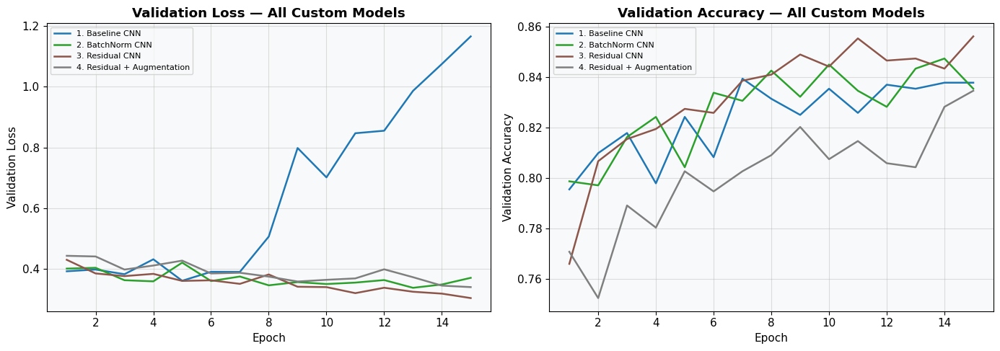

# Skin Lesion Classification: Melanoma vs Nevus

Deep learning pipeline for classifying dermoscopy images as **melanoma (MEL)** or **melanocytic nevus (NV)**, using a balanced subset of the ISIC 2018 challenge dataset.
**Authors:** Sergi Cases ([sergi.cases01@estudiant.upf.edu](mailto:sergi.cases01@estudiant.upf.edu)), Martí Pascual ([marti.pascual01@estudiant.upf.edu](mailto:marti.pascual01@estudiant.upf.edu))


## Overview

Five models are trained and compared on the validation set, then the best one is evaluated on the held-out test set:

1. **Baseline CNN**: a plain 3-block convolutional network with no regularization
2. **CNN + Batch Normalization** : batch norm after each conv layer and dropout
3. **CNN + Residual Connections** : residual blocks with skip connections
4. **Residual CNN + Data Augmentation** : random flips, rotation, and color jitter
5. **Transfer Learning (VGG-16)** : frozen ImageNet-pretrained VGG-16 as a feature extractor, with an MLP classifier on top

## Results

| Model | Validation Accuracy |
|---|---|
| 1. Baseline CNN | 0.8395 |
| 2. CNN + Batch Normalization | 0.8474 |
| 3. CNN + Residual Connections | 0.8562 |
| 4. Residual CNN + Data Augmentation | 0.8347 |
| **5. Transfer Learning (VGG-16)** | **0.8626** |



The VGG-16 transfer learning model (best on validation) was evaluated on the **test set**, achieving **86.2% accuracy**, with balanced precision/recall/F1 of 0.86 for both classes (683 MEL, 683 NV).

Residual connections and transfer learning both improved over the baseline; adding data augmentation to the residual model unexpectedly reduced accuracy — likely because the added noise outweighed the regularization benefit on this dataset size:


See the [report](Report.pdf) for full analysis, confusion matrices, and discussion.

### Sample Test Predictions (VGG-16 Transfer Learning)


Green titles indicate correct predictions, red indicates incorrect ones. Most misclassifications involve visually ambiguous lesions.

## Dataset

A processed, balanced subset of the [ISIC 2018 challenge dataset](https://arxiv.org/abs/1902.03368) (Tschandl et al., 2018; Codella et al., 2019), simplified to two classes: `MEL` (melanoma) and `NV` (nevus).

The dataset is not included in this repository due to size; download it from the course page and extract it into the project root before running the notebook.

## Repository Structure

```
.
├── Notebook.ipynb      # Full pipeline: data loading, models, training, evaluation
├── Report.pdf           # Technical report 
├── images/              # Images used in this README
└── README.md
```

## Requirements

- Python 3.8+
- PyTorch & TorchVision
- NumPy
- Matplotlib / Seaborn
- scikit-learn
- Pillow

Install with:

```bash
pip install torch torchvision numpy matplotlib seaborn scikit-learn pillow
```

## Usage

1. Download and extract the dataset into the project root (see [Dataset](#dataset)).
2. Open `Notebook.ipynb` in Jupyter or Google Colab.
3. Run all cells in order. The notebook will:
   - Load and visualize the data
   - Train and evaluate all five models on the validation set
   - Precompute and cache VGG-16 features (saved under `vgg_features/`) to avoid recomputation
   - Produce comparison plots, training curves, and confusion matrices
   - Evaluate the best model on the test set (once test data with labels is available)


## Method Notes

- Images are resized to 128×128 and normalized with ImageNet statistics for the custom CNNs; VGG-16 uses its own required preprocessing (224×224, ImageNet normalization).
- For transfer learning, VGG-16 is kept fully frozen; features from the average pooling layer (512×7×7 = 25,088 values per image) are extracted once per split, cached to disk, standardized, and fed into a 2-layer MLP (hidden sizes 512, 128).
- All other models are trained end-to-end from scratch.

## Limitations & Ethical Considerations

The task is a 2-class simplification of a real, multi-class clinical problem, uses low-resolution (128×128) images for the custom CNNs, and is trained on data sourced mainly from Austrian and Australian hospitals. Generalization to other skin tones and imaging conditions is not guaranteed. Because missing a melanoma is more costly than a false alarm, accuracy alone is not an ideal metric; melanoma recall (86.09% for the best model) would be the more clinically relevant number to optimize. See `Report.pdf` for the full discussion, since any such system should be used strictly as a decision-support tool under medical supervision, not as a standalone diagnostic.

## References

- Tschandl, P., Rosendahl, C., & Kittler, H. (2018). The HAM10000 dataset. *Scientific Data*, 5:180161.
- Codella, N. C. F., et al. (2019). Skin Lesion Analysis Toward Melanoma Detection 2018 (ISIC). *arXiv:1902.03368*.
- He, K., Zhang, X., Ren, S., & Sun, J. (2016). Deep Residual Learning for Image Recognition. *CVPR*.
- Simonyan, K., & Zisserman, A. (2014). Very Deep Convolutional Networks for Large-Scale Image Recognition. *arXiv:1409.1556*.
